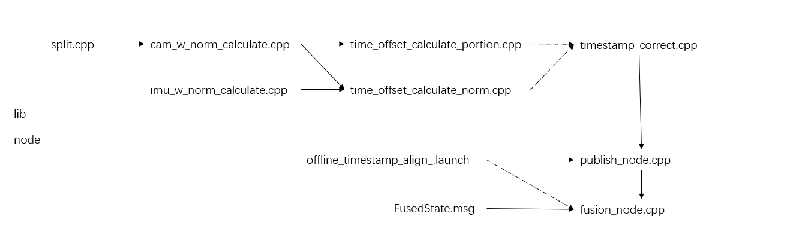
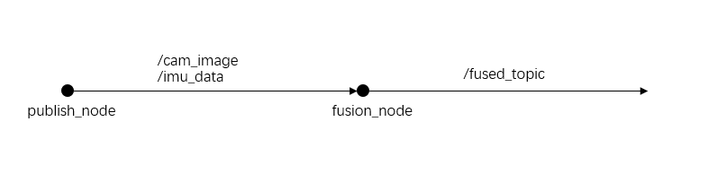

# offline_timestamp_align

## 简介
一个帮助初学者熟悉ROS1的noetic版本和时间标定的离线时间戳粗对齐项目

## 目录结构
offline_timestamp_align
├── CMakeLists.txt
├── include
│   └── offline_timestamp_align
├── launch
│   └── offline_timestamp_align.launch
├── msg
│   └── FusedState.msg
├── package.xml
└── src
    ├── cam_w_norm_calculate.cpp
    ├── fusion_node.cpp
    ├── imu_w_norm_calculate.cpp
    ├── publish_node.cpp
    ├── split.cpp
    ├── time_offset_calculate_norm.cpp
    ├── time_offset_calculate_portion.cpp
    └── timestamp_correct.cpp
    
## 文件功能简介    
CMakeLists.txt：声明编译规则
package.xml：声明依赖和包的基本信息
offline_timestamp_align.launch：一键启动ROS相关的发布和融合节点
FusedState.msg：定义融合后发布的消息
split.cpp：对bag文件进行拆解
cam_w_norm_calculate.cpp：计算三轴视觉角速度及模值
imu_w_norm_calculate.cpp：计算IMU角速度模值
time_offset_calculate_norm.cpp：凭借角速度模值估算时间偏移
time_offset_calculate_portion.cpp：凭借三轴角速度估算时间偏移
timestamp_correct.cpp：时间戳修正
publish_node.cpp：ROS发布节点
fusion_node.cpp：ROS信息融合节点

## 文件依赖关系示意图

## 节点及话题通信示意图

